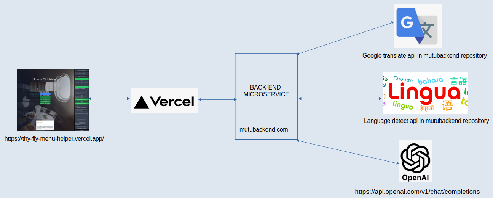

# Flight Menu Web Application

In this study, the aim is to enable passengers to see the information written on the meal menu information cards distributed to users before the meal service during the flight in their own language on the phone. With this, it will be possible for them to adjust the meal menu according to their own health conditions and personal preferences by communicating with the smart assistant in the application running on the browser on the phone.

> ## Development Environment
>
> - Next.js v15.0.3 
> - Ubuntu Linux Ubuntu 24.04.1 LTS
> - VS Code.

> ## Deployment Environment
>
> - Vercel [https://vercel.com/]

> ## Front-End Server
>
> - Vercel-[https://vercel.com/]

> ## Back-End Server
>
> - Digital Ocean-personal server droplet-Ubuntu Linux- [http://143.198.157.18:8000]

> ## OCR Library
>
> - Tesseract JS

> ## Language Translate Library
>
> - Google API on Back-End Server-[https://github.com/bregydoc/gtranslate.git]

> ## NLP Library
>
> - Google API on Back-End Server-[https://github.com/pemistahl/lingua-go.git]

> ## AI Library ( chat bot)
>
> - OpenAI

> ## Source Code
>
> - Front-End-[https://github.com/MuratTunc/thy-fly-menu-helper]

## Getting Started

Open https://thy-fly-menu-helper.vercel.app/with your browser to see the result.

## General hierarchy of the project
