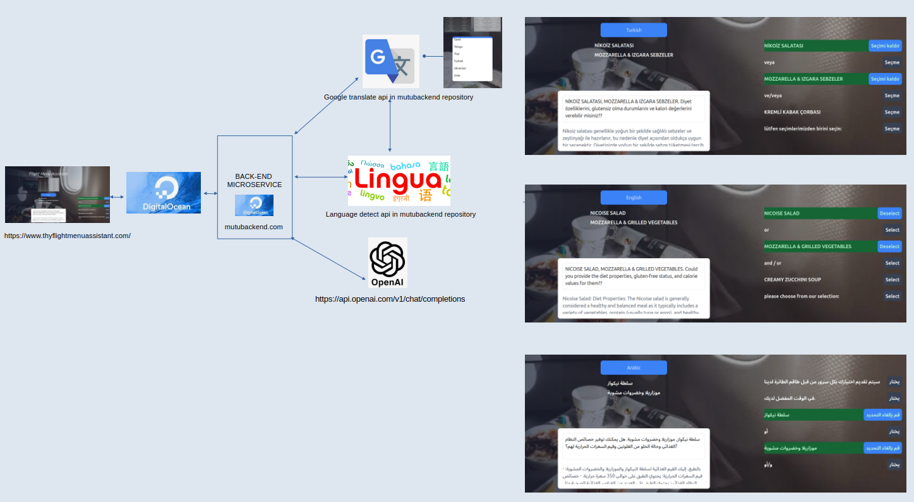

# Flight Menu Web Application

In this study, the aim is to enable passengers to see the information written on the meal menu information cards distributed to users before the meal service during the flight in their own language on the phone. With this, it will be possible for them to adjust the meal menu according to their own health conditions and personal preferences by communicating with the smart assistant in the application running on the browser on the phone.

> ## Development Environment
>
> - Next.js v15.0.3 
> - Ubuntu Linux Ubuntu 24.04.1 LTS
> - VS Code.

> ## Deployment Environment
>
> - Vercel [https://vercel.com/]

> ## Front-End Server
>
> - DigitalOcean Server Droplet-[https://www.thyflightmenuassistant.com/]
>>- Ubuntu machine for deployment web application

> ## Back-End Server
>
> - DigitalOcean Server Droplet-[https://mutubackend.com/]
>>- Ubuntu machine for backend microservice

> ## OCR Library
>
> - Tesseract JS

> ## Language Translate Library
>
> - Google API on Back-End Server-https://github.com/bregydoc/gtranslate.git
> - https://mutubackend.com/translate

> ## NLP Library
>
> - Google API on Back-End Server-https://github.com/pemistahl/lingua-go.git
> - 'https://mutubackend.com/languagecode'

> ## AI Library ( chat bot)
>
> - OpenAI
> - 'https://mutubackend.com/openai'

> ## Source Code
>
> - Front-End-https://github.com/MuratTunc/thy-fly-menu-helper
> - Back-End-https://github.com/MuratTunc/project-mutu-back-end.git

## Getting Started and How to use

Open https://www.thyflightmenuassistant.com/
When the specified language is used in the browser, 2 thy food menu selection images will appear. If the user wants to select the menu in their own language, they should select the language from the language selection button.

When you click on the menu you want, the menu will zoom in, after you click on the menu image, after a certain period of time, all the food options will be listed in your own language at the bottom right of the home page.

When you press the select remove button on the far right of the food line, the food you have selected at that moment will appear in the middle of the main page. At the bottom, in the artificial intelligence window, all the features of all the food you have selected so far, such as diet calories and gluten free, will be shown.

If he/she wants to cancel the previously selected meal, he/she can cancel it by pressing the select-remove button.

##  Why didn't I use Captura?

In my sample studies, the OPENCV algorithm results were very low in accuracy due to reasons such as light, camera resolution, the way the meal card is held, shaking and focus while taking photos. On the other hand, I did not add this part, considering that this rate would decrease even more in the dark environment inside the plane.

## General hierarchy of the project
